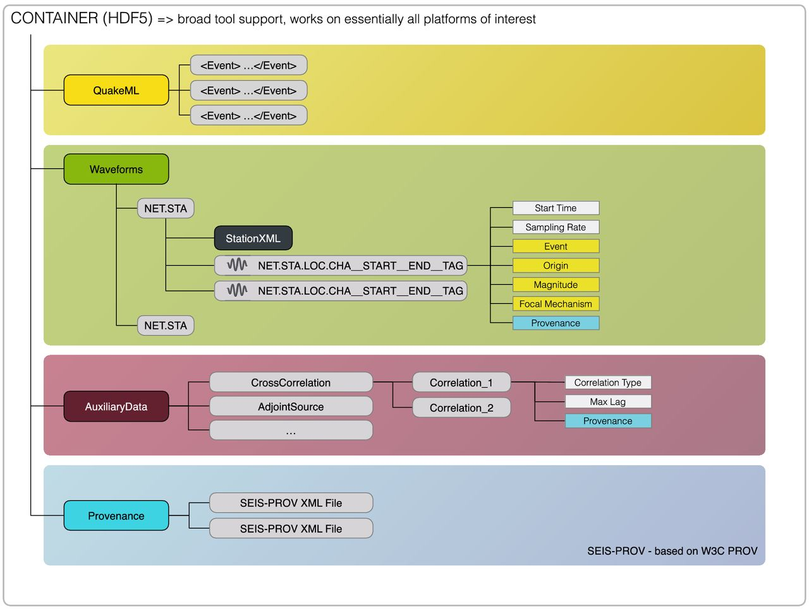

---

---

## Data Format

### Overview

The recommended seismic data standard for adoption is the Adaptable Seismic Data Format (ASDF) [Krischer et al., 2016]. Designed with modern challenges in mind, the ASDF format efficiently addresses the complexities inherent to large and detailed seismic datasets. By employing the Hierarchical Data Format Version 5 (HDF5) container format, ASDF is self-descriptive, ensuring data can be accessed and manipulated with ease across various seismological applications. Its overarching objective is to simplify the organization and exchange of seismic data, emphasizing interoperability, scalability, and the reduction of inconsistencies by amalgamating multiple seismic data components within a singular structure. The ASDF format is suitable for trigger, continuous, and Distributed Acoustic Sensing (DAS) data to name only those.

  
*Figure: ASDF data structure overview (Krischer et al. 2016)Structure of the ASDF format.*

Nested within the HDF5 container, ASDF systematically organizes seismological components, including:

- **QuakeML**: An XML-based language, QuakeML focuses on event metadata, cataloging seismic event descriptions such as event origins, magnitudes, and moment tensor solutions.
  
- **Waveform Data**: The heart of the ASDF, this section contains time series representations of seismic waveforms. In the ASDF format, waveform data are exclusively represented using single and double-precision floating point values, or signed integers. These representations are encapsulated as native data arrays within the HDF5 framework.
  
- **StationXML**: Serving as a repository for station metadata, this section contains detailed instrument information, including their responses, station coordinates, and other specific attributes. This metadata provides vital context to the waveforms. In the ASDF format, this inventory information is appended directly to the waveforms at the station level.
  
- **Auxiliary Data**: Catering to the diverse needs of seismological analyses, this section allows the storage of additional data types, such as cross-correlations or synthetic seismograms.
  
- **Provenance Data**: In the pursuit of rigorous transparency and reproducibility, this segment meticulously documents the historical progression of data alterations, enumerating each distinct processing operation along with its respective parameters. The provenance documentation adheres to the W3C PROV model [Moreau et al., 2013], a widely accepted standard for chronicling provenance specifics.


[//]: # (![ASDF Data Structure Overview]&#40;ASDF_Format_overview.jpeg&#41;)
*ASDF data structure overview from Krischer et al. (2016)*

Through its comprehensive integration of these components, ASDF paves the way for a standardized, efficient, and in-depth approach to seismological research and data management.

While the ASDF format provides a robust framework for general seismic data handling, specific adaptations are imperative to address the unique requirements of μseismic monitoring within mining environments. The proposed changes leverage the inherent flexibility and expandability of the QuakeML and StationXML formats.

> **Note on Coordinate Systems:**  
> Utilizing a Cartesian coordinate system (x, y, z) introduces inherent ambiguities. We recommend imposing constraints on the alignment of the x, y, and z axes to ensure the coordinate system is right-handed and aligned with geographical axes. Specifically, we advocate the use of ENU and NED coordinate systems.
>
> μquake version 2.0 introduces the `Coordinates` Class. The handling is done by converting the `Coordinate` object to JSON and writing the JSON string as an object extra parameters.
>
> ```xml
> <?xml version='1.0' encoding='utf-8'?>
>     <q:quakeml xmlns:mq="https://microquake.ai/xml/event/1" 
>     xmlns="http://quakeml.org/xmlns/bed/1.2" 
>     xmlns:q="http://quakeml.org/xmlns/quakeml/1.2">
> ```

The modifications discussed in the following sections, particularly concerning QuakeML and StationXML formats, have been operationalized in the μquake library. This library extends the Obspy package and is tailored to the specific needs of μseismic monitoring within the mining contexts.

### QuakeML

#### Modifications

| **Object** | **New Parameter** | **Description**         | **Type**         |
|------------|-------------------|-------------------------|--------|----------|
| Origin     | Coordinates       | Coordinates information | Coordinates[^1]  |
|            | f<sub>0</sub>\(f_0\)           | Corner frequency        | float            |
| Magnitude  | E<sub>p</sub>\(E_p\)           | *P*\(P\)-wave energy         | float           | float |
|            | E<sub>s</sub>\(E_s\)           | *S*\(S\)-wave energy         | float           | float |

[^1]: Coordinate class described in the Appendix

We propose straightforward modifications to the QuakeML format to better suit *museismic* applications. The first concerns the expression of coordinates using the Cartesian system previously described instead of the longitude, latitude, and depth/elevation. The second pertains to expanding the magnitude definition to include the corner frequency and the *P*- and *S*-wave velocities. The third involves the overriding of event types.

Instead of the standard spherical coordinate system that relies on latitude and longitude for location specification, we advocate for a Cartesian coordinate system. Specifically, we recommend emptying the traditional fields for latitude, longitude, elevation, and depth. As a substitute, we propose adding a description of the Coordinates as a new field. The coordinate description object is implemented in *muquake* from version 2.0. In the current implementation, the information is stored as a JSON string in the extra parameters of the Origin object. The extra parameters are then stored in a specific namespace inside the QuakeML file. The coordinate object includes the x, y, and z coordinate, a description of the coordinate system (either ENU or NED), and elements to allow for converting the coordinates between multiple representations including latitude, longitude if the required information is provided.

We propose an enhancement to the magnitude definition in QuakeML to represent seismic source properties better. The existing schema falls short in capturing key parameters such as the corner frequency (\(f_0\)), and the *P*- and *S*-wave energies (\(E_p\) and \(E_s\), respectively). Similar to our approach for coordinate system modification, we suggest including \(f_0\), \(E_p\), and \(E_s\) as extra parameters of the Magnitude object. This enables the on-the-fly calculation of other source parameters using the seismic moment (\(M_0\)), corner frequency, and wave energies. Relationships among these source parameters are elaborated in Appendix.

Transitioning to event classifications, the QuakeML schema has a predefined set of seismic event types that do not fully accommodate the specialized needs of *museismic* monitoring. We propose mapping existing event types to new, mining-specific descriptors and directly including a generic look-up table in the code for on-the-fly translation. While efforts were made to create logical mappings, limitations in the existing event types posed challenges in finding intuitive counterparts. The following table presents this mapping between standard and *museismic* event types.

| Event Type (mining)                | Event Type (QuakeML)              |
|-----------------------------------|-----------------------------------|
| earthquake/large event            | earthquake                        |
| seismic event                     | induced or triggered event        |
| offsite event                     | atmospheric event                 |
| rock burst                        | rock burst                        |
| fall of ground/rockfall           | cavity collapse                   |
| blast                             | explosion                         |
| blast sequence                    | accidental explosion              |
| development blast                 | industrial explosion              |
| production blast                  | mining explosion                 |
| far away blast/open pit blast     | quarry blast                      |
| offsite blast                     | nuclear explosion                 |
| paste firing                      | chemical explosion                |
| calibration blast                 | controlled explosion              |
| other blast/slashing              | experimental explosion            |
| mid-shift blast/slash blast       | industrial explosion              |
| raise bore                        | hydroacoustic event               |
| crusher noise                     | road cut                         |
| orepass noise                     | collapse                         |
| drilling noise                    | acoustic noise                   |
| electrical noise                  | thunder                          |
| scaling noise                     | anthropogenic event               |
| mechanical noise                  | crash                            |
| test pulse                        | sonic boom                       |
| unidentified noise/other noise    | other event                      |
| duplicate                         | boat crash                       |
| unknown                           | plane crash                      |
| tap test/test                     | avalanche                        |

*Note: The table continues with the respective mappings.*

## Waveforms and StationXML

### Modifications

| **Object**  | **New Parameter** | **Description**                          | **Type**  |
|-------------|-------------------|------------------------------------------|-----------|
| Network     | Time Zone         | IANA Time Zone or time offset            | string    |
| Station     | x                 | x-coordinate                             | float     |
|             | y                 | y-coordinate                             | float     |
|             | z                 | z-coordinate                             | float     |
| Channel     | x                 | x-coordinate                             | float     |
|             | y                 | y-coordinate                             | float     |
|             | z                 | z-coordinate                             | float     |
|             | oriented          | True if orientation is known             | boolean   |
|             | active            | True if the channel is active            | boolean   |

In a manner analogous to our QuakeML modifications, we adapt the StationXML format to meet the specific needs of the μseismic context. The changes affect the `Network`, `Station`, and `Channel` definitions. Support for a local coordinate system is added to the `Station` and `Channel` definitions, and two new parameters are introduced in the `Channel` definition to indicate orientation and current activity status. The mutable 'active' flag allows for the temporary exclusion of a component due to timing issues or other transient problems. These changes include support of the `Coordinates` object in the `Station` and `Channel` objects, and the storage of the `Coordinates` as JSON string as extra parameters. Time zone information is added to the Network definition to facilitate conversion between local and UTC time. The provided time zone must either represent an offset from Coordinated Universal Time (UTC) or correspond to a valid entry in the [IANA time zone database](https://www.iana.org/time-zones). The μquake library ensures seamless integration of these modifications and replicates Obspy's default behavior regarding location data. It also allows the extraction of predefined values from the extra parameters section as typical object properties.

The waveform format does not require any alteration.

### Parameter Validation
As for the QuakeML, the validation for the newly introduced parameters is performed within the μquake library. For standard parameters, validation is handled by the Obspy package. This ensures a cohesive framework for both standard and specialized seismic data types.

### Stream Naming Convention

The ASDF file format combines waveforms and inventory data. To ensure flawless integration, we must adopt a robust and standardized "stream" naming convention to ensure unambiguous association between waveforms and inventory. 

ASDF adopts a relaxed version of the SEED Identifier Convention, previously part of QuakeML and StationXML standards and now extended to the waveform data. The StationXML does not restrict the string length; QuakeML does. We therefore suggest adopting the convention presented in section 3.3.5 of the [QuakeML Version 1.2 (revision 20130214b)](https://quake.ethz.ch/quakeml/docs/latest?action=AttachFile&do=get&target=QuakeML-BED.pdf).

## Auxiliary Data

### Overview

The design of the ASDF format incorporates provisions for extensibility, enabling the inclusion of auxiliary data beyond the predefined schema for catalogs, inventory information, and waveform data. Given the dynamic and varied nature of seismological research, and the specificity of the different fields where seismology applies, including museismic monitoring in mines, it is neither possible nor practically feasible to create a rigid schema that accommodates all potential use cases. While ASDF prescribes a structured format for fundamental seismic data types like catalogs, inventory, and waveforms, it concurrently provides flexible containers, which structure is yet to be defined. These containers capture the broad and evolving range of applications in seismology, both current and future, thereby ensuring the format's utility and relevance over time.

Auxiliary data in ASDF is intentionally loosely defined, allowing for a broad range of data types beyond seismic waveforms. Each piece of auxiliary data is allocated within an arbitrarily nested path in the auxiliary data group. The data can take on any dimensional form, accompanied by a flexible key-value representation for metadata. This flexibility is not accidental but rather designed to cater to the rapidly evolving needs and active research in various areas of seismology.

As of version 2.0, μquake offers support for the ASDF format, although it has yet to exploit the format's full capabilities. To date, μquake has implemented methods to store two types of auxiliary data that enhance the system performance: rays and alternative event locations obtained through resampling methods used for statistical uncertainty estimation, including Monte Carlo and jackknife techniques. These inclusions obviate the need for repeated, computationally intensive operations by saving results for future use. Looking ahead, we anticipate that community-driven conventions for storing other types of data will emerge, further leveraging the extensibility of the ASDF format for standardized and comprehensive data storage.

### Rays

Rays and their derivative information serve as key inputs in microseismic monitoring analyses, such as magnitude calculation and SMTI evaluation. Calculating these rays on the fly poses computational challenges. Without precomputed rays, analyses often resort to the straight-ray assumption or require resource-intensive recalculations. Microseismic monitoring systems rarely keep or save ray information due to the lack of containers or structures for preserving it. This hinders the ability to easily reproduce results, especially when velocity models and travel-time grids are not readily accessible. Storing rays in the ASDF file within μquake streamlines computational processes by obviating repetitive, costly ray tracing and by providing more complete information downstream.

| Object            | Parameter     | Description                                        | Type               |
|-------------------|---------------|----------------------------------------------------|--------------------|
| WaveformStreamID  | site_code     | Site code of the receiver station                  | str                |
|                   | event_id      | ResourceIdentifier for the seismic event          | ResourceIdentifier |
|                   | origin_id     | ResourceIdentifier for the origin                 | ResourceIdentifier |
|                   | arrival_id    | ResourceIdentifier for the arrival                | ResourceIdentifier |
| Ray trace         | nodes         | List of 3D coordinates defining the ray path       | np.array           |
| Ray parameters    | phase...      |                                                    |                    |

<!--stackedit_data:
eyJoaXN0b3J5IjpbLTEyNzY5MjUxOTZdfQ==
-->